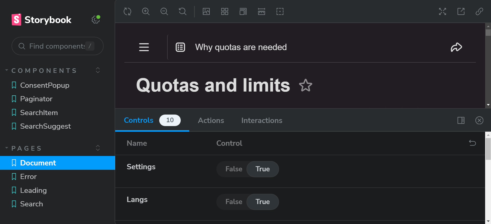
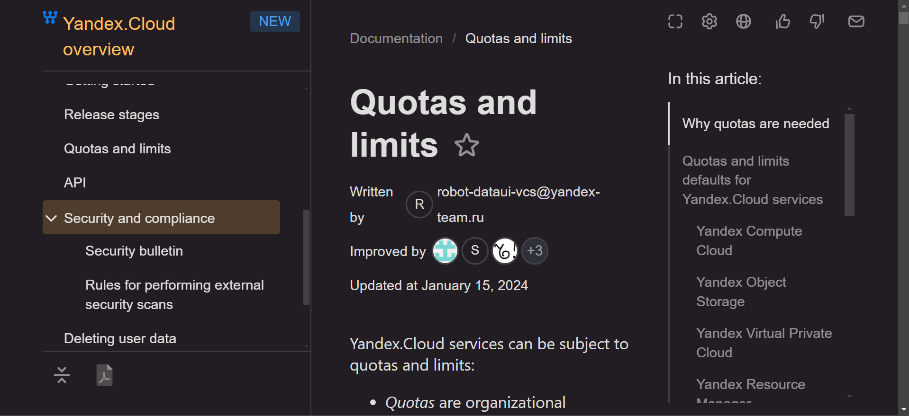

[](https://www.npmjs.org/package/@diplodoc/components) [](https://diplodoc-platform.github.io/components)

# YFM Docs Components

Компоненты для Yandex Flavored Markdown Documentation.

## Installation

`npm i @diplodoc/components`

## Usage

Append js

```js
// In most cases append transform runtime
import "@doc-tools/transform/dist/js/yfm.js";

import {createRoot} from 'react-dom/client';
import {ThemeProvider} from '@gravity-ui/uikit';

// configure components
import {configure as configureUikit} from '@gravity-ui/uikit';
import {configure as configureDocs} from '@diplodoc/components';

configureUikit({lang: 'ru'});

// can be reconfigured in any moment
configureDocs({
    lang: 'ru',
    // optionally configure allowed translations
    loc: {ru, en, tr, ...}
})

// The theme must be applied. To do that wrap your app in ThemeProvider
const root = createRoot(document.getElementById('root'));
root.render(
    <ThemeProvider theme="light">
        <App />
    </ThemeProvider>,
);
```

Append css

```css
/*project.css*/

/*Append components styles*/
@import '@diplodoc/components';

/*Append components theme*/
@import '@diplodoc/components/themes/common';

/*In most cases append transform styles*/
@import '@doc-tools/transform/dist/css/yfm.css';
```

## Development

To build the project correctly you need to install `python@2`.
Visit [python.org/downloads](https://www.python.org/downloads/release/python-2718/) to get the latest version.

Install Dependencies

```shell
npm ci
cd demo && npm ci
```

To start the development server with storybook run the following:

```shell
npm run dev
```

## Testing

We use [Playwright](https://playwright.dev/docs/intro) for testing.

### Preparation

Each version of Playwright needs specific versions of browser binaries to operate.

```bash
# Install playwright browsers and dependencies (run once on initial setup)
npm run playwright:install
```

By default playwright will use http://localhost:6006 as URL for storybook server.

If you want to change it, you should add `.env` file in repository's root directory with the data below:

```bash
# the URL where the storybook is running
BASE_URL= # for example:'http://localhost:6006'
```

### Running tests locally (Linux/MacOS)

**Option 1: Storybook in Docker, tests locally (recommended for development)**

This approach is easier for debugging - you can see storybook running in your browser.

1. Start storybook in Docker (in one terminal):
```bash
npm run playwright:docker:dev
```

2. Run tests locally (in another terminal):
```bash
npm run playwright:local
```

Update snapshots:
```bash
npm run playwright:local:update
```

**Option 2: Everything local (storybook + tests)**

All tests (storybook will be started automatically):

```bash
npm run playwright
```

Update snapshots:

```bash
npm run playwright:update
```

Clear cache:

```bash
npm run playwright:clear-cache
```

### Running tests in Docker (recommended for consistent screenshots)

**Note:** Tests run in Docker container to ensure consistent screenshots across different operating systems (Mac, Linux, Windows).

All tests:

```bash
npm run playwright:docker
```

Single test:

```bash
./playwright/playwright-docker.sh 'npm run playwright -- src/components/YourComponent/__tests__/YourComponent.spec.ts'
```

Several sets of test files from different folders:

```bash
./playwright/playwright-docker.sh 'npm run playwright -- src/components/Component1/__tests__ src/components/Component2/__tests__'
```

Update snapshots:

```bash
npm run playwright:docker:update
```

Clear Docker cache (if you have issues with dependencies):

```bash
npm run playwright:docker:clear-cache
```

### Running tests on Windows

```bash
npm run playwright:docker:windows
```

These commands run storybook server before tests.

If storybook server is already running, playwright will use it for tests and won't run another server.

### Test reports

To see test reports run:

```bash
npx playwright show-report
```

### Writing and updating tests

All tests are in `./__tests__` folder.

`**.spec.ts` files contain test code.
To write or change tests use [Playwright documentation](https://playwright.dev/docs/intro).

For screenshot testing you need write page URL in your test file. You need page **without storybook panel**.


Open page without storybook panel in new tab by using 'Open canvas in new tab' button and **use that URL in tests.**



After running tests playwright will create folder for snapshots (if it didn't exist).

`**.__screenshots__` folders contain screenshots which are used for comparison with test screenshots.

If reference screenshot is incorrect you can update it:

```bash
npm run playwright:update
```

Or using Docker:

```bash
npm run playwright:docker:update
```

## License

MIT
